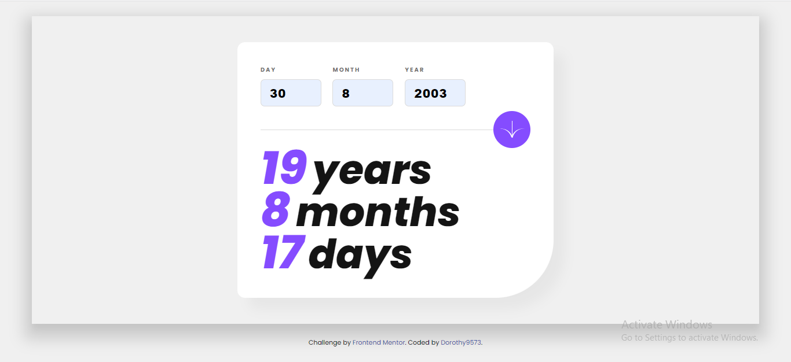

# Frontend Mentor - Age calculator app solution

This is a solution to the [Age calculator app challenge on Frontend Mentor](https://www.frontendmentor.io/challenges/age-calculator-app-dF9DFFpj-Q). Frontend Mentor challenges help you improve your coding skills by building realistic projects. 

## Table of contents

- [Overview](#overview)
  - [The challenge](#the-challenge)
  - [Screenshot](#screenshot)
  - [Links](#links)
- [My process](#my-process)
  - [Built with](#built-with)
  - [Continued development](#continued-development)
- [Author](#author)

## Overview

The Age Calculator app is a simple and user-friendly web application that allows users to calculate their age based on the input of their birth date. It provides an intuitive interface where users can enter their day, month, and year of birth and instantly obtain their age in years, months, and days.

The app incorporates validation to ensure that the input is valid and within a reasonable range. It checks for the required fields, verifies the date's validity, and ensures that the birth year is in the past. If any errors are found, appropriate error messages are displayed to guide the user.

Upon successful validation, the app calculates the age by comparing the inputted birth date with the current date. It accurately determines the number of years, months, and days elapsed since the user's birth, taking into account leap years and variable month lengths.

The Age Calculator app features a clean and visually appealing design, making it easy for users to interact with the input fields and view their calculated age. The results are dynamically displayed, providing an instant and engaging user experience.

Furthermore, the app includes a subtle animation effect when displaying the age results, adding a touch of interactivity and visual interest to the user interface.

Overall, the Age Calculator app is a useful tool for anyone curious about their precise age or looking to quickly calculate age-related information. It offers a convenient way to obtain accurate age calculations in a visually pleasing and intuitive manner.

### The challenge

Users should be able to:

- View an age in years, months, and days after submitting a valid date through the form
- Receive validation errors if:
  - Any field is empty when the form is submitted
  - The day number is not between 1-31
  - The month number is not between 1-12
  - The year is in the future
  - The date is invalid e.g. 31/04/1991 (there are 30 days in April)
- View the optimal layout for the interface depending on their device's screen size
- See hover and focus states for all interactive elements on the page
- **Bonus**: See the age numbers animate to their final number when the form is submitted

### Screenshot

### Links

- Solution URL: [Add solution URL here](https://your-solution-url.com)
- Live Site URL: (https://dorothy9573.github.io/Age-calculator-app/), (https://dorothy-age-calculator-app.netlify.app/)

## My process

### Built with

- HTML
- CSS
- JavaScript

### Continued development

The calculator app doesn't calculate in respect to the leap years and I am going to implement that soon

## Author

- Website - [Oloje Oluwaseyi Dorothy](https://dorothyportfolio.netlify.app/)
- Frontend Mentor - [@Dorothy9573](https://www.frontendmentor.io/profile/yourusername)
- Twitter - [@dorothyyy9573](https://www.twitter.com/yourusername)